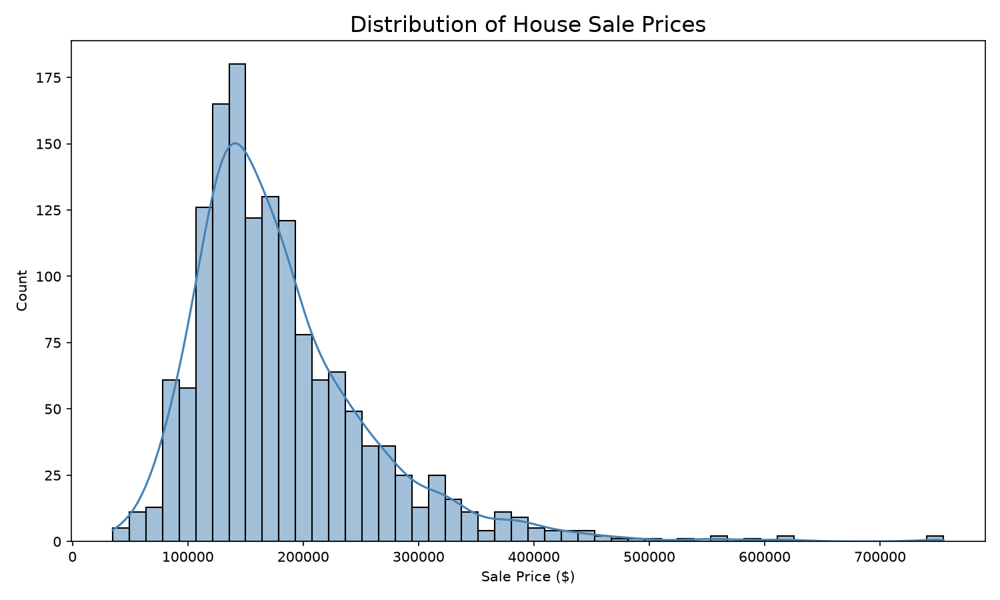
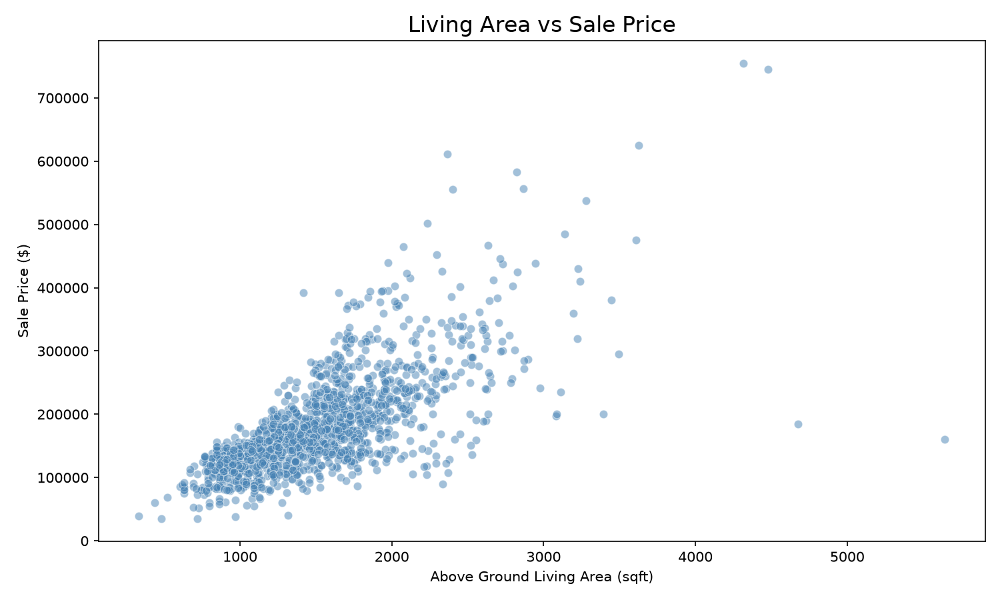
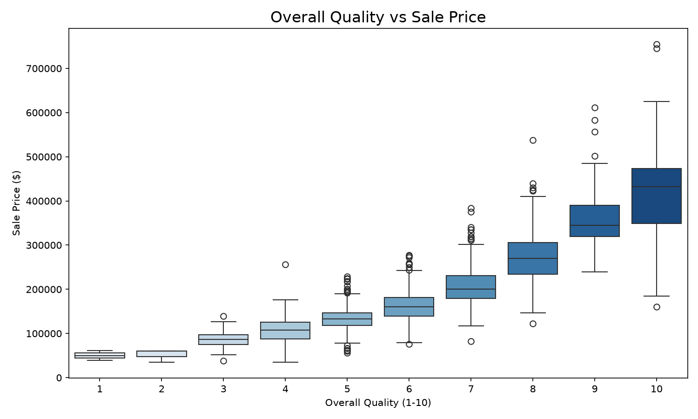
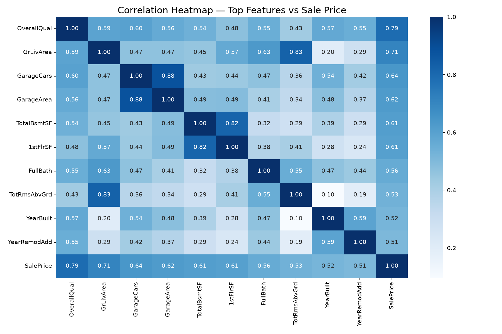
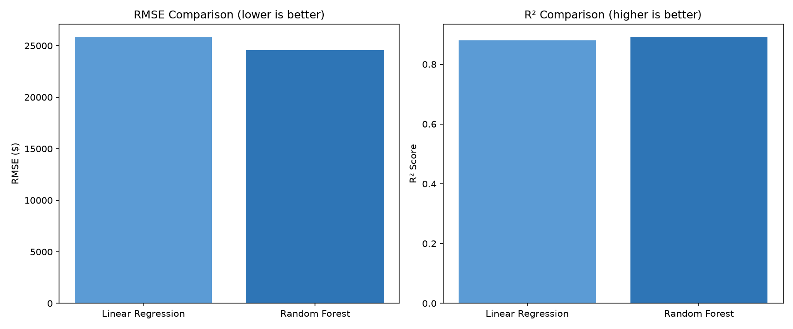
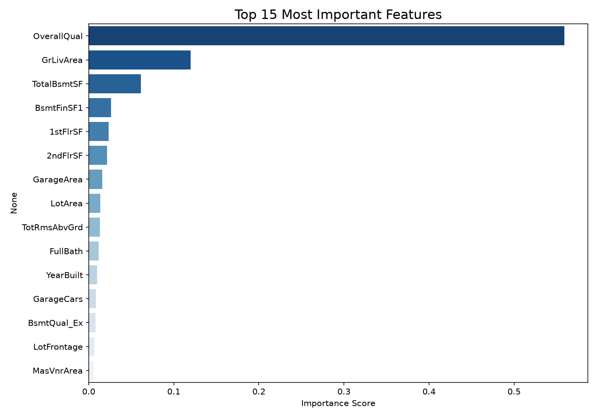

# House Prices Prediction

Predicting house sale prices using machine learning (Random Forest). Built from scratch as a beginner ML project using Python, pandas, and scikit-learn.

## Results

| Model | RMSE | R2 Score |
|---|---|---|
| Linear Regression | ~$40,000 | ~0.75 |
| Random Forest | $24,589 | 0.8905 |

The Random Forest model explains 89% of the variation in house prices and predicts within ~$24k on average.

## Key Visualizations

### Price Distribution

### Living Area vs Sale Price

### Quality vs Sale Price

### Correlation Heatmap

### Model Comparison

### Feature Importance

## Key Findings

- OverallQual is the single strongest predictor of price (0.79 correlation)
- GrLivArea (living area) is second most important (0.71 correlation)
- Houses built after 2000 sell for significantly more
- Price distribution is right-skewed, most houses sell between $100k-$250k

## How to Run

git clone https://github.com/archiep867-sys/house-prices-prediction.git
cd house-prices-prediction
python3 -m venv env
source env/bin/activate
pip install -r requirements.txt
jupyter notebook

Then open notebooks in order: 01_explore, 02_clean, 03_visualize, 04_model

## Tools

- Python 3.11
- pandas - data loading, cleaning, manipulation
- scikit-learn - ML models, train/test split, evaluation
- matplotlib and seaborn - data visualization
- Kaggle House Prices dataset (1,460 houses, 81 features)

## What I Learned

- How to handle missing values intelligently
- One-hot encoding categorical variables for ML
- The difference between Linear Regression and Random Forest
- How to evaluate models using RMSE and R2
- End-to-end ML pipeline from raw data to saved model
